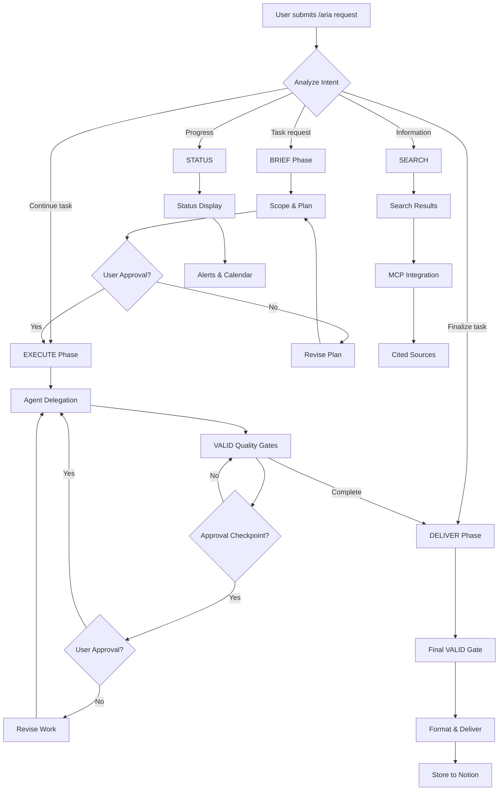

# /aria Command

ARIA's unified command interface for regulatory affairs and quality assurance workflows.

## Usage

```bash
/aria "natural language request"
/aria brief "task description"
/aria execute TASK-ID
/aria deliver TASK-ID
/aria search "query"
/aria status
```

## Parameters

| Parameter | Type | Required | Description |
|-----------|------|----------|-------------|
| query | string | No | Natural language request or task description |

## Examples

### Default (Natural Language)

When invoked with a natural language request, ARIA automatically routes through the Brief-Execute-Deliver pipeline.

```bash
/aria "510(k) submission preparation"
/aria "Perform risk analysis for this device"
/aria "Create a CAPA for the complaint trend"
/aria "Review this document for regulatory compliance"
/aria "Find the latest FDA guidance on software validation"
/aria "Prepare internal audit checklist"
```

### brief

Start the Brief phase to scope and plan a task.

```bash
/aria brief "Prepare 510(k) submission for our new monitor"
```

**Behavior:**
- Analyzes the request and identifies applicable regulations
- Collects device and market information from the user
- Creates an action plan with agent assignments
- Presents the plan for user approval before execution

### execute

Run the Execute phase for an active task.

```bash
/aria execute TASK-001
```

**Behavior:**
- Delegates work to specialized agents per the approved plan
- Applies VALID quality checks at each stage
- Pauses at approval checkpoints for user confirmation

### deliver

Run the Deliver phase to finalize and output results.

```bash
/aria deliver TASK-001
```

**Behavior:**
- Runs final VALID quality gate
- Formats deliverables for the target audience
- Stores results in Notion (when configured)
- Provides next-step recommendations

### search

Search for regulatory information, standards, guidance documents, or precedents.

```bash
/aria search "predicate device for patient monitor class II"
```

**Behavior:**
- Searches across Notion databases, Context7 MCP, and Google Workspace
- Returns structured results with source citations
- Filters by market, standard, or document type
- Auto-saves relevant findings to Knowledge Base

### status

Display current task progress and system status.

```bash
/aria status
```

**Behavior:**
- Shows active tasks and their current phase
- Lists pending approval checkpoints
- Displays upcoming deadlines and alerts
- Aggregates data from CAPA Tracker, Risk Register, Submission Tracker, Document Registry, and Google Calendar

## Phase 4 Capabilities

### MCP Server Integration

ARIA Phase 4 integrates three MCP servers for enhanced capabilities:

#### 1. Context7 MCP
Provides up-to-date regulatory documentation:
- FDA 21 CFR 820 (Quality System Regulation)
- ISO 13485 (Medical devices - Quality management systems)
- EU MDR 2017/745 (Medical Device Regulation)
- IEC 62366 (Usability engineering)
- ISO 14971 (Risk management)

**Usage:**
```bash
/aria knowledge "ISO 14971 risk analysis" --context7-fallback
/aria search "MDR classification rules"
```

#### 2. Sequential Thinking MCP
Enables complex regulatory pathway analysis:
- Multi-market submission strategy
- Technology trade-off analysis
- Risk-benefit evaluation
- Compliance requirement mapping

**Usage:**
```bash
/aria "Analyze multi-market submission strategy for FDA and EU MDR"
```

#### 3. Google Workspace MCP
Integrates with Gmail, Docs, Drive, and Calendar:
- Regulatory correspondence tracking
- Collaborative document management
- Calendar integration for deadlines and audits
- Evidence document storage

**Usage:**
```bash
/aria search "FDA 510(k) request" --filter emails --date "last-30-days"
/aria status  # Shows Google Calendar events
```

### Enhanced Commands

#### /aria search
Unified search across:
- **Notion Databases** (6 databases)
- **Context7 MCP** (regulatory documents)
- **Google Workspace** (Gmail, Docs, Drive)

Features:
- Relevance scoring and ranking
- Category and date filtering
- Auto-save to Knowledge Base
- Related document recommendations

#### /aria knowledge
Knowledge base management with Context7 fallback:
- Local knowledge base search
- Automatic Context7 fallback (relevance < 70%)
- Auto-save of Context7 results
- Knowledge usage metrics

#### /aria status
Comprehensive status dashboard:
- CAPA Tracker status
- Risk Register status
- Submission Tracker status
- Document Registry status
- Google Calendar events
- Alert system (Critical/Warning/Info)

#### /aria audit
Audit trail search and export:
- Decision history tracking
- Document change tracking
- Agent activity logging
- CSV/PDF report export
- Regulatory compliance evidence

## MCP Setup Instructions

### Step 1: Configure MCP Servers

Add MCP servers to `.mcp.json`:

```json
{
  "mcpServers": {
    "context7": {
      "command": "npx",
      "args": ["-y", "@upstash/context7-mcp", "--api-key", "your-api-key"],
      "description": "Up-to-date regulatory documentation lookup via Upstash"
    },
    "sequential-thinking": {
      "command": "npx",
      "args": ["-y", "@modelcontextprotocol/server-sequential-thinking"],
      "description": "Complex regulatory pathway analysis"
    },
    "google-workspace": {
      "command": "npx",
      "args": ["-y", "@google/mcp-server-google-workspace"],
      "description": "Google Workspace integration for Phase 4"
    }
  }
}
```

### Step 2: Initialize ARIA

Run the initialization command:

```bash
/aria init
```

This will:
- Set up Notion integration (6 databases)
- Configure MCP server connections
- Initialize Google Workspace OAuth
- Create Knowledge Base structure
- Set up Audit Log database

### Step 3: Verify MCP Integration

Test each MCP server:

```bash
# Test Context7
/aria knowledge "FDA 510(k) requirements" --context7-fallback

# Test Sequential Thinking
/aria "Analyze regulatory strategy for multi-market submission"

# Test Google Workspace
/aria search "regulatory correspondence" --filter emails
/aria status  # Should show Google Calendar events
```

## Behavior Flow



## When to Use

| Scenario | Command |
|----------|---------|
| Start a new regulatory task | `/aria "description"` or `/aria brief "description"` |
| Continue work on an existing task | `/aria execute TASK-ID` |
| Finalize and deliver results | `/aria deliver TASK-ID` |
| Look up regulatory information | `/aria search "query"` |
| Check progress on tasks | `/aria status` |
| Query knowledge base | `/aria knowledge "topic"` |
| Search audit trail | `/aria audit search "query"` |

## VALID Quality Framework

All ARIA workflows follow the VALID quality framework:

| Dimension | Definition | Verification |
|-----------|-----------|-------------|
| **V**erified | Content matches source regulation text | Cross-reference with regulation originals |
| **A**ccurate | Data, figures, and references are correct and current | Source validation, date checks |
| **L**inked | Traceability between requirements, documents, and evidence | Traceability matrix verification |
| **I**nspectable | Audit trail maintained, decision rationale documented | Audit trail completeness check |
| **D**eliverable | Output meets submission format requirements | Template conformance check |

## Version History

- **Phase 4** (2026-02-09): MCP integration, Google Workspace support, enhanced search/knowledge/status/audit commands
- **Phase 3** (2026-02-07): Universal Business Agents, 8 RA/QA domain agents, 9 knowledge skills
- **Phase 2** (2026-02-06): Brief-Execute-Deliver workflow, VALID quality framework
- **Phase 1** (2026-02-05): Initial ARIA system, core RA/QA agents

## Support

For detailed documentation on each command:
- `/aria brief help` - Brief phase documentation
- `/aria execute help` - Execute phase documentation
- `/aria deliver help` - Deliver phase documentation
- `/aria search help` - Search command documentation
- `/aria status help` - Status dashboard documentation
- `/aria knowledge help` - Knowledge base documentation
- `/aria audit help` - Audit trail documentation

---

**Version:** 4.0.0 (Phase 4 - MCP Integration and Google Workspace)
**Last Updated:** 2026-02-09
**Language:** English
**Core Principle:** Natural language interface for regulatory affairs and quality assurance workflows
