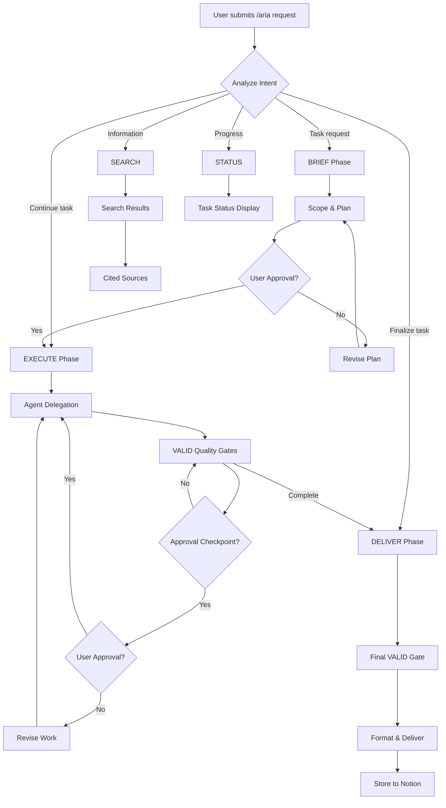

# /aria Command

ARIA's unified command interface for regulatory affairs and quality assurance workflows.

## Usage

```bash
/aria "natural language request"
/aria brief "task description"
/aria execute TASK-ID
/aria deliver TASK-ID
/aria search "query"
/aria status
```

## Parameters

| Parameter | Type | Required | Description |
|-----------|------|----------|-------------|
| query | string | No | Natural language request or task description |

## Examples

### Default (Natural Language)

When invoked with a natural language request, ARIA automatically routes through the Brief-Execute-Deliver pipeline.

```bash
/aria "510(k) submission preparation"
/aria "Perform risk analysis for this device"
/aria "Create a CAPA for the complaint trend"
/aria "Review this document for regulatory compliance"
/aria "Find the latest FDA guidance on software validation"
/aria "Prepare internal audit checklist"
```

### brief

Start the Brief phase to scope and plan a task.

```bash
/aria brief "Prepare 510(k) submission for our new monitor"
```

**Behavior:**
- Analyzes the request and identifies applicable regulations
- Collects device and market information from the user
- Creates an action plan with agent assignments
- Presents the plan for user approval before execution

### execute

Run the Execute phase for an active task.

```bash
/aria execute TASK-001
```

**Behavior:**
- Delegates work to specialized agents per the approved plan
- Applies VALID quality checks at each stage
- Pauses at approval checkpoints for user confirmation

### deliver

Run the Deliver phase to finalize and output results.

```bash
/aria deliver TASK-001
```

**Behavior:**
- Runs final VALID quality gate
- Formats deliverables for the target audience
- Stores results in Notion (when configured)
- Provides next-step recommendations

### search

Search for regulatory information, standards, guidance documents, or precedents.

```bash
/aria search "predicate device for patient monitor class II"
```

**Behavior:**
- Searches FDA databases, standards references, and knowledge base
- Returns structured results with source citations
- Filters by market, standard, or document type

### status

Display current task progress and pending items.

```bash
/aria status
```

**Behavior:**
- Shows active tasks and their current phase
- Lists pending approval checkpoints
- Displays upcoming deadlines

## Behavior Flow



## When to Use

| Scenario | Command |
|----------|---------|
| Start a new regulatory task | `/aria "description"` or `/aria brief "description"` |
| Continue work on an existing task | `/aria execute TASK-ID` |
| Finalize and deliver results | `/aria deliver TASK-ID` |
| Look up regulatory information | `/aria search "query"` |
| Check progress on tasks | `/aria status` |
